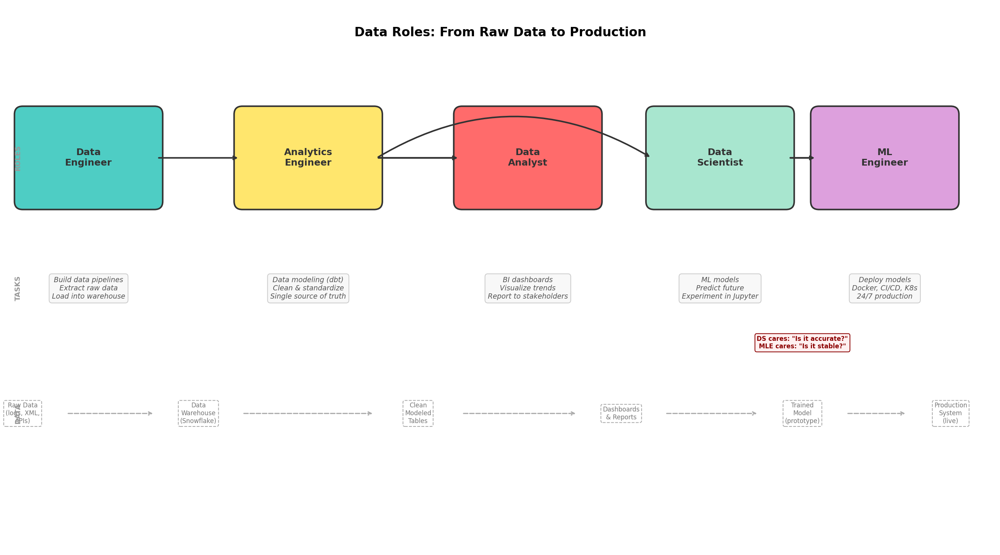

# Paradox Interactive - Player Retention Study

## Background

This project was done as part of a Junior Data Scientist interview preparation for Paradox Interactive. The task was to analyze player churn — figuring out why players stop playing and how to predict it.

I used a public dataset ([Online Gaming Behavior Dataset](https://www.kaggle.com/datasets/rabieelkharoua/predict-online-gaming-behavior-dataset)) as a proxy since I didn't have access to real Paradox data. The dataset has ~40k player records with behavioral features like session frequency, play time, and engagement levels.

One thing I want to be upfront about: this dataset is simulated, and the data is quite "clean" — no missing values, no outliers, and many features turned out to be randomly distributed. That limited some of the analysis, but I think the value here is in the methodology and thought process rather than the specific numbers.

## What I Did

The analysis follows a 5-step pipeline:

### Step 1: Preprocessing
Basic data quality checks — missing values, duplicates, outliers, data range validation, distribution skewness, categorical consistency. Everything came back clean, which is expected for simulated data but still a necessary step.

### Step 2: EDA (Exploratory Data Analysis)
This is where things got interesting. I compared player behavior across three engagement levels (Low / Medium / High) without making any assumptions about what "churn" means yet.

Key findings:
- **SessionsPerWeek** and **AvgSessionDurationMinutes** are by far the strongest signals that separate Low engagement players from the rest
- Demographic features (age, gender, location) and game-related categories (genre, difficulty) showed no significant relationship with engagement
- Players with 0 weekly sessions are almost exclusively in the Low engagement group (93.6%)

I also ran K-Means clustering to see if there are natural player segments. The algorithm found 4 groups, and the "high playtime but low level" segment had the highest proportion of Low engagement players.

### Step 3: Label Definition
Based on EDA results (not assumptions), I defined:
- **Hard churn**: EngagementLevel == "Low" — these players genuinely behave differently from active players
- **Soft churn**: Players who are still Medium/High but whose SessionsPerWeek and AvgSessionDurationMinutes have dropped into the range typical of Low players (using the 75th percentile of the Low group as thresholds)

About 10% of non-churned players fall into the soft churn category, which feels like a reasonable early warning group.

### Step 4: Feature Engineering
Encoded categorical variables (one-hot), selected features, dropped identifiers and the EngagementLevel column (since it was used to create the label). Ended up with 17 features.

### Step 5: Modeling
Trained Logistic Regression (baseline) and Random Forest. Since missing a churning player is worse than a false alarm, I focused on **recall** as the primary metric.

Results:
| Model | Recall | ROC-AUC |
|---|---|---|
| Logistic Regression | 67.6% | 0.905 |
| Random Forest (default) | 86.8% | 0.938 |
| Random Forest (tuned threshold) | **90.7%** | 0.938 |

By lowering the classification threshold from 0.5 to 0.2, the model catches 90.7% of churning players. The tradeoff is more false positives, but in a retention context that just means sending a few extra re-engagement offers to players who were fine anyway — low cost compared to losing a player.

## What I Learned

A few honest reflections:

1. **EDA before labels, not after.** I initially made the mistake of defining churn first and then doing EDA around that definition. That led to circular reasoning. Starting with pure exploration and letting the data guide the label definition made much more sense.

2. **Simulated data has limits.** Most features in this dataset are independently random, so a lot of the analysis came back as "not significant." With real player data, I'd expect much richer patterns — things like play time declining over weeks, or DLC purchases correlating with retention.

3. **The threshold matters as much as the model.** The default 0.5 threshold isn't always right. For churn prediction, tuning it lower to prioritize recall made a meaningful difference.

## Repo Structure

```
analysis/
  step1_preprocessing.py      # Data quality checks
  step2_eda.py                 # Exploratory analysis
  step3_label_definition.py    # Hard & soft churn definition
  step4_feature_engineering.py # Feature preparation
  step5_modeling.py            # Model training & evaluation
  processed_data.csv           # Processed dataset
  plots/                       # All generated visualizations
```

## Data Mapping

The interview task specified these player features. Here's how they map to the dataset I used:

| Task Requirement | Dataset Field | Match Quality |
|---|---|---|
| Total playtime | PlayTimeHours | Partial |
| Sessions in the last 7 days | SessionsPerWeek | Direct |
| DLC ownership | InGamePurchases | Approximate |
| Time since last login | — | Missing |
| Country | Location (region-level) | Partial |
| Total lifetime playtime | PlayTimeHours | Partial |

The biggest gap is "Time since last login" — the dataset doesn't have this, which means I couldn't define churn the traditional way (e.g., 28 days inactive). This is noted as a limitation.

## A Note on Data Roles

During my last interview, I mixed up some of the data role terminology — I think it had to do with how my university courses were named. For example, one of my courses covered ML deployment and pipeline orchestration but was called "Data Engineering," which blurred the lines for me.

After studying for the dbt Fundamentals certification and spending more time in the Snowflake ecosystem, I now have a much clearer picture of how these roles fit together in practice:



- **Data Engineer** — builds the pipelines that move raw data (logs, APIs, files) into the warehouse
- **Analytics Engineer** — models and standardizes the data using tools like dbt, so everyone in the company sees the same numbers
- **Data Analyst** — creates dashboards and reports from the clean tables, tells the business what happened
- **Data Scientist** — builds ML models to predict what will happen next, experiments in notebooks
- **ML Engineer** — takes the DS's prototype model and deploys it to production with Docker, CI/CD, and K8s

The key distinction I missed before: DS cares about "is the model accurate?", MLE cares about "is it stable in production?" They're complementary, not the same thing.
